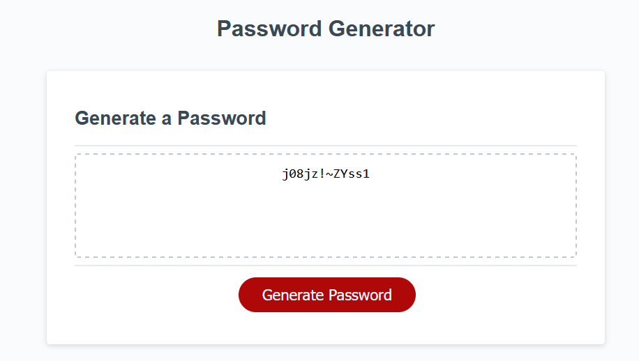

# Secure-Password-Generator

## Description

As a developer you have many instances requiring a secure password, and you don't want them all to be the same.
This will help generate a random secure password based on certain criteria you select from the promts.
This project provided me more time to work with loops, and updating an object based on imput.

## Installation

N/A
## Usage

To use this application:

Open the webpage located here (https://matwll.github.io/secure-password-generator/)
Click the Generate Password button
Proceed through the prompts
The password will be displayed in the box as text so you can copy it

## License

MIT License